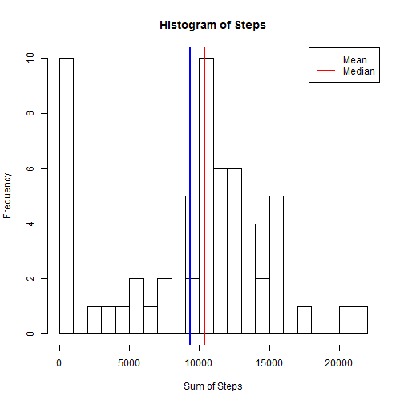
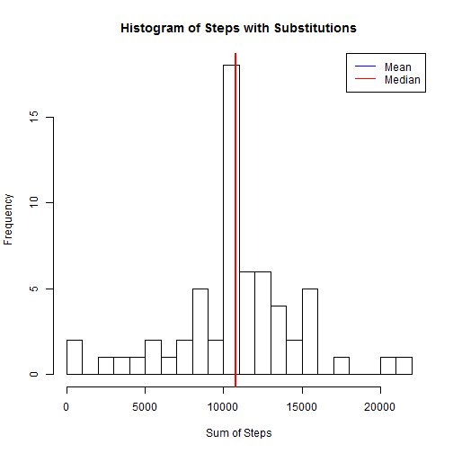
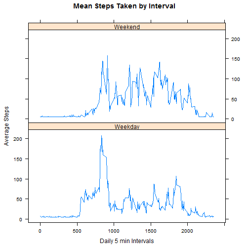

#Section 1
##Loading and preprocessing data


```r
##Course 5 - Reproducible Research
##Peer Assessment 1

##identify the zip file
if (!file.exists("data.zip")){
  fileZip <- "https://d396qusza40orc.cloudfront.net/repdata%2Fdata%2Factivity.zip"
  download.file(fileZip, destfile="data.zip", method="wininet")
  dateDownloaded <- date()
}

# Function to check whether package is installed
is.installed <- function(mypkg){
  is.element(mypkg, installed.packages()[,1])
} 

# check if package is installed
## Credit goes to silentbang for this is.installed function on Stack Overflow
if (!is.installed("tidyr")){
  install.packages("tidyr")
}
library(tidyr)

if (!is.installed("Hmisc")){
  install.packages("Hmisc")
}
library(Hmisc)
```

```
## Loading required package: grid
## Loading required package: lattice
## Loading required package: survival
## Loading required package: Formula
## Loading required package: ggplot2
## 
## Attaching package: 'Hmisc'
## 
## The following objects are masked from 'package:base':
## 
##     format.pval, round.POSIXt, trunc.POSIXt, units
```

```r
library(lattice)

##Unzip the directory
(unzip("data.zip"))
```

```
## [1] "./activity.csv"
```

```r
##Placing in a table
data <- read.csv("activity.csv", sep=";", header=TRUE, stringsAsFactors = FALSE)

##Cleaning up data
data2 <- separate(data, steps.date.interval, c("Steps", "Date", "Interval"), sep = ",")
data2$Interval <- as.numeric(data2$Interval)
data2$Date <- as.factor(data2$Date)
data2$Steps <- suppressWarnings(as.numeric(data2$Steps))
```

#Section 2
##Mean Total Steps taken per day


```r
##Total number of steps
SumbyDate <-aggregate(data2$Steps, list(Date = data2$Date), sum, na.rm=TRUE)

##Assigning names
names(SumbyDate) <- c("Date","SumSteps")

##Calculate and Report the mean and median of steps per day
MeanbyDate <- mean(SumbyDate$SumSteps)
MedianbyDate <- median(SumbyDate$SumSteps)

print(paste("Mean: ", MeanbyDate))
```

```
## [1] "Mean:  9354.22950819672"
```

```r
print(paste("Median: ", MedianbyDate))
```

```
## [1] "Median:  10395"
```

```r
##Plotting SumbyDate
hist(SumbyDate$SumSteps, breaks = 20, main = "Histogram of Steps", xlab="Sum of Steps")
abline(v = MeanbyDate, col = "blue", lwd = 2)
abline(v = MedianbyDate, col = "red", lwd = 2)
legend("topright", legend=c("Mean", "Median"), col=c("blue", "red"), lty=1:1)
```

 

#Section 3
##Average daily activity pattern


```r
##Aggregating by Interval
AvgbyInterval <- aggregate(data2$Steps, list(Interval = data2$Interval), mean, na.rm=TRUE)
SumbyInterval <- aggregate(data2$Steps, list(Interval = data2$Interval), sum, na.rm=TRUE)
ByInterval <- merge(AvgbyInterval, SumbyInterval, by="Interval")
names(ByInterval) <- c("Interval", "Mean", "Sum")

##Calculating max
MaxMean <-  ByInterval$Mean[which.max(ByInterval$Mean)]
MaxInterval <- ByInterval$Interval[which.max(ByInterval$Mean)]
RowMax <- which(ByInterval$Mean==MaxMean)

print(paste("Max Steps: ", MaxMean))
```

```
## [1] "Max Steps:  206.169811320755"
```

```r
print(paste("Interval: ", MaxInterval))
```

```
## [1] "Interval:  835"
```

```r
##Plotting by Interval
plot(ByInterval$Interval, ByInterval$Mean, main="Mean Steps Taken", xlab="Daily 5 min Intervals", ylab="Average Steps", type="l")
abline(v = MaxInterval, col="red", lwd=2)
legend("topright", legend=MaxInterval, col ="red", lty=1)
```

 

#Section 4
##Imputing missing values


```r
##Count of missing values
naCount <- sum(is.na(data2$Steps))
print(paste("Missing Values: ", naCount))
```

```
## [1] "Missing Values:  2304"
```

```r
##Imputing missing values
data2$Steps <- with(data2, impute(Steps, mean))
```
###Decision to use the mean as the replacement value for the NAs
###The imputed mean and median values do differ from the original values.
###The impact of imputed values was to move the mean and median closer together.


```r
##Total number of steps - with NAs filled in
SumbyDate2 <-aggregate(data2$Steps, list(Date = data2$Date), sum, na.rm=TRUE)
SumbyDate2$x <- as.integer(SumbyDate2$x)
names(SumbyDate2) <- c("Date","SumSteps")

##Calculate and Report the mean and median of steps per day
MeanbyDate2 <- mean(SumbyDate2$SumSteps)
MedianbyDate2 <- median(SumbyDate2$SumSteps)

print(paste("Imputed Mean: ", MeanbyDate2))
```

```
## [1] "Imputed Mean:  10766.1639344262"
```

```r
print(paste("Imputed Median: ", MedianbyDate2))
```

```
## [1] "Imputed Median:  10766"
```

```r
##Plotting AvgbyInterval2
hist(SumbyDate2$SumSteps, breaks = 20, main = "Histogram of Steps with Substitutions", xlab="Sum of Steps")
abline(v = MeanbyDate2, col = "blue", lwd = 2)
abline(v = MedianbyDate2, col = "red", lwd = 2)
legend("topright", legend=c("Mean", "Median"), col=c("blue", "red"), lty=1:1)
```

 

#Section 5
##Differences between Weekday and Weekend


```r
##Differences in activity patterns (weekday or weekend)
data2$Day <- weekdays(as.Date(data2$Date))
data2$Weekday <- ifelse(data2$Day %in% c("Saturday", "Sunday"),"Weekend", "Weekday")

##Creating factor of Weekday and Weekend
data2$Weekday <- as.factor(data2$Weekday)
sumStepsbyType <- aggregate(Steps ~ Weekday + Interval, data=data2, mean)

p = xyplot(data=sumStepsbyType, 
  Steps ~ Interval|Weekday,
  main="Mean Steps Taken by Interval", 
  xlab="Daily 5 min Intervals", 
  ylab="Average Steps",
  layout=c(1,2),
  type="l"
  )
print(p)
```

 

